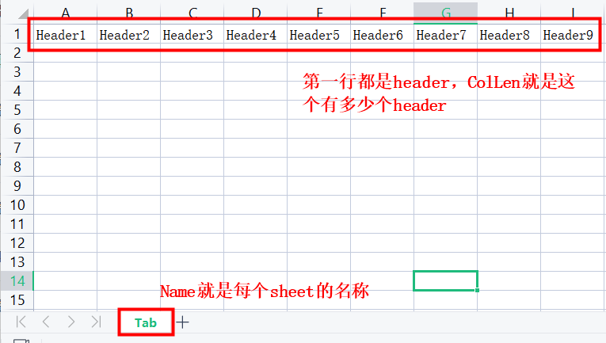

### Go excel

----

**注意：这个代码的封装主要目的就是能够导出一个excel和读一个excel，不包含颜色呀，样式什么的。**

#### Excel操作逻辑

- 写入excel的时候，需要指定X轴和Y轴，X轴是大写英文字母，Y轴是以1开始递增的数字。X轴26个英文字母用完后，以`AA` 、`AB`的格式扩张；
- 每次写入的是一个sheet，不能一次写入多个sheet，可以切换sheet来写入数据；
- 读取excel的时候，返回是一个切片，每个切片的元素的类型是map，key为标题的值，value就是对应的数据。

#### Example

切换sheet的范例，见example文件夹内的代码

```go
func main() {
   // 初始化 excel operator
	operator := excel.New([]excel.SheetConf{
		{Name: "测试中文Tab", ColLen: 20},
	})
	defer operator.Close()

	// 写入header
	headers := []string{}

	for i := 0; i < 20; i++ {
		headers = append(headers, fmt.Sprintf("%d", i))
	}

	if err := operator.WriteHeader(headers); err != nil {
		fmt.Println(fmt.Errorf("write header err : %s", err.Error()))
		return
	}

	// 写入数据
	data := make([][]string, 5)

	for i := 0; i < 5; i++ {
		data[i] = make([]string, 20)
		for j := 0; j < 20; j++ {
			data[i][j] = fmt.Sprintf("%d%d", i, j)
		}
	}

	if err := operator.WriteAll(data); err != nil {
		fmt.Println(fmt.Errorf("write data err : %s", err.Error()))
		return
	}

    // 保存 excel
	_ = operator.SaveAs("testdata/new.xlsx")
}
```

#### Export方法说明

##### 初始化一个operator -- New

```go
type SheetConf struct {
	Name   string `json:"name"`
	ColLen int    `json:"colLen"`
}

// New 初始化返回一个Excel操作类，默认使用Sheet1作为首页和当前操作的sheet
func New(sheets []SheetConf) *Operator {

	if len(sheets) == 0 {
		sheets = defaultSheets
	}

	var (
		defaultSheet = sheets[0]
		operator     = &Operator{
			curSheet:  defaultSheet.Name,
			excelFile: excelize.NewFile(),
			sheetMap:  make(map[string]*sheet),
		}
	)

	defer func() {
		// excelize.NewFile会默认创建一个Sheet1的sheet
		if len(sheets) != 0 {
			operator.excelFile.DeleteSheet("Sheet1")
		}
	}()

	for i := 0; i < len(sheets); i++ {
		sheetIndex := operator.newSheet(sheets[i].Name)
		operator.sheetMap[sheets[i].Name] = &sheet{
			index:           sheetIndex,
			name:            sheets[i].Name,
			colMaxLen:       sheets[i].ColLen,
			rowCellTemplate: nil,
		}
	}

	operator.SwitchSheet(defaultSheet.Name)

	return operator
}
```

函数`New`用来初始化一个excel的`operator`，对excel的写入都是通过`operator`提供的方法。

`SheetConf`类型，里面的`Name`就是excel表格每个sheet的名称，`ColLen`是这个sheet的顶部header的数量



> 如果传入的是一个空的SheetsConf，会初始化一个`Sheet1`的sheet，不会报错

**初始化之后，默认切到第一个sheet，作为要接下去要写入的sheet**

##### 切换sheet -- SwitchSheet

```go
// SwitchSheet 切换excel的tab
func (o *Operator) SwitchSheet(sheetName string) {

	var (
		sheetTab = o.sheetMap[sheetName]
	)

	sheetTab.initHeader()
	o.excelFile.SetActiveSheet(sheetTab.index)
	o.curSheet = sheetName
}
```

`SwitchSheet`会去初始化Sheet的header定位，每个sheet都有自己的`rowCellTemplate`，即每次要write的时候的定位模板。原本需要write excel时指定X和Y，在接下去的write的方法就只需要传入写入的值即可。

```go
type sheet struct {
	index           int
	name            string
	colMaxLen       int
	rowCellTemplate []*cell
}

type cell struct {
	Col   string // 横轴字母表
	Row   int    // 第几行
	Value string
}
```

比如`colMaxLen`是5，那`rowCellTemplate`切片也会初始化5个值：

```go
[{Col: "A"},{Col: "B"},{Col: "C"},{Col: "D"},{Col: "E"}]
```

##### 写入excel -- Write

###### WriteHeader

此函数默认写入第一行，当做header来写入，默认写入数据前，都要先写入一下header

```go
// WriteHeader 写入header
func (o *Operator) WriteHeader(headers []string) error {

	...

	for i := 0; i < len(headers); i++ {
		curSheet.rowCellTemplate[i].Row = 1
		curSheet.rowCellTemplate[i].Value = headers[i]
	}

	return o.WriteRow(curSheet.rowCellTemplate...)
}
```

###### WriteAll

`WriteAll`是写入所有数据，excel表格可以理解为二维数组，X轴就是A、B、C这种的，Y轴是数字递增。传入的数据也必须是二维数组的。

```go
// WriteAll 写入所有的数据，不包括header
func (o *Operator) WriteAll(cells [][]string) error {
    
   var rowBias = 2
   ...

   for i := 0; i < rows; i++ {
       
      ...

      for j := 0; j < cols; j++ {
         curSheet.rowCellTemplate[j].Row = i + rowBias
         curSheet.rowCellTemplate[j].Value = cells[i][j]
      }

      if err := o.WriteRow(curSheet.rowCellTemplate...); err != nil {
         return err
      }
   }

   return nil
}
```

###### WriteRow

`WriteRow`是写入每行数据，`WriteHeader`和`WriteAll`也是调用此方法去写入。调用`excelFile.SetCellValue`的`location`，就是`cell`类型的方法，把X轴和Y轴拼接起来。

```go
// WriteRow 写入单行数据
func (o *Operator) WriteRow(cells ...*cell) error {
   curSheet := o.getCurSheet()

   if len(cells) > curSheet.colMaxLen {
      return OutOfColumn
   }

   for _, c := range cells {
      if err := o.excelFile.SetCellValue(o.curSheet, c.location(), c.Value); err != nil {
         return err
      }
   }
   return nil
}
```

##### 保存excel -- SaveAs

调用write相关方法后，还不能算保存到excel里面，需要调用`SaveAs`的方法来落盘。传入的路径，如果文件夹没有创建的，会自动创建文件夹。

##### 读取excel - Read

读取excel表格，就是用`Read`方法，返回的是`[]map[string]string`类型的结果。每个切片的值代表着一行，map的key就是header的值，value就是数据。

------

#### 单元测试

主要函数的单元测试均已覆盖，可以看包内`_test`后缀的文件

通过`go test -v -coverprofile=cover.out`指令可以执行单元测试，单元测试覆盖率在 91.9%。

------

欢迎指教~
